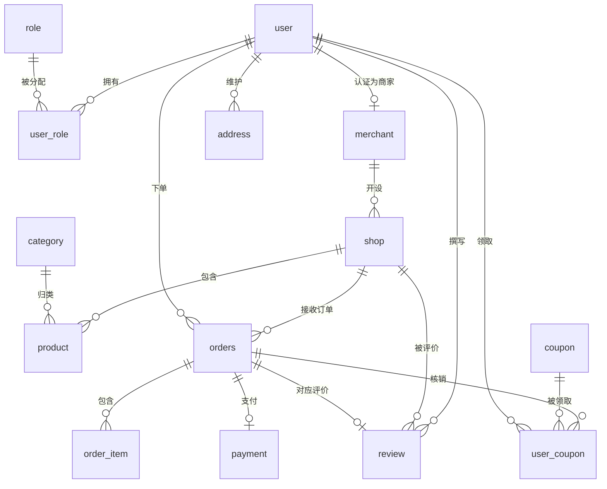

# CityGo 数据库设计文档

> 版本：Phase 2 | 适用数据库：MySQL 8.4（utf8mb4 / utf8mb4_unicode_ci，InnoDB）

## 一、设计概览

CityGo 共 14 张业务表，覆盖用户/权限、商家/店铺、商品/分类、订单/支付、营销/评价/地址等核心链路。

| # | 表名 | 职责 |
| --- | --- | --- |
| 1 | `user` | 平台用户账号信息（用户名、密码、手机号等） |
| 2 | `role` | 角色定义（普通用户/商家/管理员） |
| 3 | `user_role` | 用户与角色的多对多关联 |
| 4 | `merchant` | 商家平台身份资料（与用户关联） |
| 5 | `shop` | 店铺（一个商家可开多家） |
| 6 | `category` | 商品分类（支持层级） |
| 7 | `product` | 商品（挂靠在店铺、归属某一分类） |
| 8 | `orders` | 订单主表（含收货信息快照与状态流转） |
| 9 | `order_item` | 订单明细（商品信息快照） |
| 10 | `payment` | 支付记录 |
| 11 | `coupon` | 优惠券模板（平台券/商家券） |
| 12 | `user_coupon` | 用户已领取的优惠券 |
| 13 | `review` | 订单评价（一单一评） |
| 14 | `address` | 用户收货地址 |

---

## 二、ER 图（Mermaid）

---

## 三、表结构明细

> 下表省去每张表都相同的三个公共字段，它们在 DDL 中真实存在：
> `create_time`（创建时间）、`update_time`（更新时间）、`deleted`（逻辑删除：0 未删除 1 已删除）。

### 1. user 用户表

| 字段名 | 类型 | 约束 | 注释 |
| --- | --- | --- | --- |
| id | BIGINT | PK | 主键 |
| username | VARCHAR(50) | NOT NULL | 用户名 |
| password | VARCHAR(100) | NOT NULL | 密码（BCrypt 加密存储） |
| phone | VARCHAR(20) | NULL | 手机号（可空，预留） |
| nickname | VARCHAR(50) | NULL | 昵称 |
| avatar | VARCHAR(255) | NULL | 头像 URL |
| status | TINYINT | NOT NULL DEFAULT 1 | 状态：1 正常 0 禁用 |

| 索引名 | 列 | 用途与理由 |
| --- | --- | --- |
| uk_username | username | 用户名全局唯一，登录时按用户名精确查询，唯一索引既限制重名又加速查询 |
| idx_phone | phone | 手机号登录/检索场景，唯一性弱于用户名（可能出现空），用普通索引 |

### 2. role 角色表

| 字段名 | 类型 | 约束 | 注释 |
| --- | --- | --- | --- |
| id | BIGINT | PK | 主键 |
| code | VARCHAR(30) | NOT NULL | 角色编码 |
| name | VARCHAR(50) | NOT NULL | 角色名称 |
| description | VARCHAR(255) | NULL | 角色描述 |

| 索引名 | 列 | 用途与理由 |
| --- | --- | --- |
| uk_code | code | 角色编码唯一，业务上以 code 作为稳定标识，初始化/校验场景频繁命中 |

### 3. user_role 用户角色关联表

| 字段名 | 类型 | 约束 | 注释 |
| --- | --- | --- | --- |
| id | BIGINT | PK | 主键 |
| user_id | BIGINT | NOT NULL | 用户ID |
| role_id | BIGINT | NOT NULL | 角色ID |

| 索引名 | 列 | 用途与理由 |
| --- | --- | --- |
| uk_user_role | user_id, role_id | 防止同一用户重复绑定同一角色（数据幂等兜底） |
| idx_role_id | role_id | 反向查询：某角色下有哪些用户场景 |

### 4. merchant 商家表

| 字段名 | 类型 | 约束 | 注释 |
| --- | --- | --- | --- |
| id | BIGINT | PK | 主键 |
| user_id | BIGINT | NOT NULL | 关联用户ID |
| merchant_name | VARCHAR(100) | NOT NULL | 商家名称 |
| contact_name | VARCHAR(50) | NOT NULL | 联系人姓名 |
| contact_phone | VARCHAR(20) | NOT NULL | 联系电话 |
| logo | VARCHAR(255) | NULL | 商家 logo |
| description | VARCHAR(500) | NULL | 商家简介 |
| status | TINYINT | NOT NULL DEFAULT 1 | 状态：1 正常 0 禁用 |

| 索引名 | 列 | 用途与理由 |
| --- | --- | --- |
| uk_user_id | user_id | 一个用户至多一个商家身份，唯一索引保证不重复 |
| idx_contact_phone | contact_phone | 运营按联系电话检索商家 |

### 5. shop 店铺表

| 字段名 | 类型 | 约束 | 注释 |
| --- | --- | --- | --- |
| id | BIGINT | PK | 主键 |
| merchant_id | BIGINT | NOT NULL | 所属商家ID |
| shop_name | VARCHAR(100) | NOT NULL | 店铺名称 |
| logo | VARCHAR(255) | NULL | 店铺 logo |
| description | VARCHAR(500) | NULL | 店铺简介 |
| province | VARCHAR(50) | NULL | 省 |
| city | VARCHAR(50) | NOT NULL | 市 |
| district | VARCHAR(50) | NULL | 区 |
| address | VARCHAR(255) | NOT NULL | 详细地址 |
| longitude | DECIMAL(10,6) | NULL | 经度 |
| latitude | DECIMAL(10,6) | NULL | 纬度 |
| score | DECIMAL(2,1) | NOT NULL DEFAULT 0.0 | 评分（0-5，后续由评价计算） |
| monthly_sales | INT | NOT NULL DEFAULT 0 | 月销量（冗余字段，下单时累加） |
| open_status | TINYINT | NOT NULL DEFAULT 1 | 营业状态：1 营业中 0 打烊 |
| open_time | TIME | NULL | 开始营业时间 |
| close_time | TIME | NULL | 结束营业时间 |
| notice | VARCHAR(500) | NULL | 店铺公告 |
| status | TINYINT | NOT NULL DEFAULT 1 | 状态：1 正常 0 禁用 |

| 索引名 | 列 | 用途与理由 |
| --- | --- | --- |
| idx_merchant_id | merchant_id | 一个商家查询其全部店铺 |
| idx_city_district | city, district | 按城市/区域筛选店铺（商圈首页场景），联合索引最左前缀命中 city |
| idx_score | score | 按评分排序展示热门店铺，降低排序成本 |

### 6. category 商品分类表

| 字段名 | 类型 | 约束 | 注释 |
| --- | --- | --- | --- |
| id | BIGINT | PK | 主键 |
| parent_id | BIGINT | NOT NULL DEFAULT 0 | 父分类ID，0 表示一级分类 |
| category_name | VARCHAR(50) | NOT NULL | 分类名称 |
| icon | VARCHAR(255) | NULL | 分类图标 |
| sort | INT | NOT NULL DEFAULT 0 | 排序值，越小越靠前 |
| status | TINYINT | NOT NULL DEFAULT 1 | 状态：1 启用 0 停用 |

| 索引名 | 列 | 用途与理由 |
| --- | --- | --- |
| idx_parent_id | parent_id | 查询某父分类下的全部子分类 |

### 7. product 商品表

| 字段名 | 类型 | 约束 | 注释 |
| --- | --- | --- | --- |
| id | BIGINT | PK | 主键 |
| shop_id | BIGINT | NOT NULL | 所属店铺ID |
| category_id | BIGINT | NOT NULL | 分类ID |
| product_name | VARCHAR(100) | NOT NULL | 商品名称 |
| description | VARCHAR(1000) | NULL | 商品描述 |
| cover_image | VARCHAR(255) | NULL | 主图 URL |
| images | TEXT | NULL | 轮播图（逗号分隔多个 URL） |
| price | DECIMAL(10,2) | NOT NULL | 售价 |
| original_price | DECIMAL(10,2) | NULL | 原价（划线价） |
| stock | INT | NOT NULL DEFAULT 0 | 库存 |
| sales | INT | NOT NULL DEFAULT 0 | 销量（冗余字段，下单时累加） |
| status | TINYINT | NOT NULL DEFAULT 1 | 状态：1 上架 0 下架 |

| 索引名 | 列 | 用途与理由 |
| --- | --- | --- |
| idx_shop_status | shop_id, status | 店铺内只查上架商品（店铺主页高频），联合索引一次命中 |
| idx_category_id | category_id | 分类下商品列表 |
| idx_price | price | 价格筛选/排序场景 |

### 8. orders 订单表（order 为保留字，故用 orders）

| 字段名 | 类型 | 约束 | 注释 |
| --- | --- | --- | --- |
| id | BIGINT | PK | 主键 |
| order_no | VARCHAR(32) | NOT NULL | 业务订单号（雪花号，全局唯一） |
| user_id | BIGINT | NOT NULL | 下单用户ID |
| shop_id | BIGINT | NOT NULL | 店铺ID |
| total_amount | DECIMAL(10,2) | NOT NULL | 商品总额 |
| discount_amount | DECIMAL(10,2) | NOT NULL DEFAULT 0.00 | 优惠金额 |
| pay_amount | DECIMAL(10,2) | NOT NULL | 实付金额 |
| status | TINYINT | NOT NULL DEFAULT 10 | 订单状态：10 待支付 20 已支付 30 商家已接单 40 配送中 50 已完成 60 已取消 70 退款中 80 已退款 |
| receiver_name | VARCHAR(50) | NOT NULL | 收货人姓名（下单时快照） |
| receiver_phone | VARCHAR(20) | NOT NULL | 收货人电话（快照） |
| receiver_address | VARCHAR(255) | NOT NULL | 收货地址（快照） |
| remark | VARCHAR(255) | NULL | 买家备注 |
| paid_time | DATETIME | NULL | 支付时间 |
| completed_time | DATETIME | NULL | 完成时间 |
| cancel_time | DATETIME | NULL | 取消时间 |
| cancel_reason | VARCHAR(255) | NULL | 取消原因 |

| 索引名 | 列 | 用途与理由 |
| --- | --- | --- |
| uk_order_no | order_no | 业务订单号全局唯一，对外对账/查询主入口 |
| idx_user_id | user_id | 查询某用户的全部订单 |
| idx_shop_id | shop_id | 商家后台查询本店订单 |
| idx_user_status | user_id, status | 我的订单按状态过滤（并列在 user_id 之后形成最左前缀，兼顾客服/查询场景） |
| idx_create_time | create_time | 按时间范围查询/统计订单，支撑对账与订单列表排序 |

### 9. order_item 订单明细表

| 字段名 | 类型 | 约束 | 注释 |
| --- | --- | --- | --- |
| id | BIGINT | PK | 主键 |
| order_id | BIGINT | NOT NULL | 订单ID |
| product_id | BIGINT | NOT NULL | 商品ID |
| product_name | VARCHAR(100) | NOT NULL | 商品名称（快照） |
| product_image | VARCHAR(255) | NULL | 商品主图（快照） |
| price | DECIMAL(10,2) | NOT NULL | 成交单价（快照） |
| quantity | INT | NOT NULL | 购买数量 |
| total_amount | DECIMAL(10,2) | NOT NULL | 小计金额 |

| 索引名 | 列 | 用途与理由 |
| --- | --- | --- |
| idx_order_id | order_id | 按订单取全部明细 |
| idx_product_id | product_id | 反向查某商品卖过的订单，供运营分析 |

### 10. payment 支付记录表

| 字段名 | 类型 | 约束 | 注释 |
| --- | --- | --- | --- |
| id | BIGINT | PK | 主键 |
| payment_no | VARCHAR(32) | NOT NULL | 支付流水号（全局唯一） |
| order_id | BIGINT | NOT NULL | 订单ID |
| user_id | BIGINT | NOT NULL | 支付用户ID |
| amount | DECIMAL(10,2) | NOT NULL | 支付金额 |
| pay_method | TINYINT | NOT NULL DEFAULT 1 | 支付方式：1 微信 2 支付宝 3 模拟支付 |
| status | TINYINT | NOT NULL DEFAULT 1 | 状态：1 待支付 2 支付成功 3 支付失败 4 已退款 |
| paid_time | DATETIME | NULL | 支付成功时间 |

| 索引名 | 列 | 用途与理由 |
| --- | --- | --- |
| uk_payment_no | payment_no | 支付流水全局唯一，防止重复支付/重复入账 |
| idx_order_id | order_id | 按订单一对多查支付尝试记录（配合唯一索引兜底） |
| idx_user_id | user_id | 用户的支付历史查询 |

### 11. coupon 优惠券模板表

| 字段名 | 类型 | 约束 | 注释 |
| --- | --- | --- | --- |
| id | BIGINT | PK | 主键 |
| coupon_name | VARCHAR(100) | NOT NULL | 优惠券名称 |
| type | TINYINT | NOT NULL | 类型：1 满减券 2 折扣券 |
| threshold_amount | DECIMAL(10,2) | NOT NULL DEFAULT 0.00 | 满减门槛（满多少可用，0 表示无门槛） |
| discount_amount | DECIMAL(10,2) | NULL | 满减金额（type=1 时使用） |
| discount_rate | TINYINT | NULL | 折扣率（type=2 时使用，85 表示 8.5 折） |
| total_count | INT | NOT NULL | 发行总量 |
| received_count | INT | NOT NULL DEFAULT 0 | 已领取数量（领取时累加） |
| per_user_limit | INT | NOT NULL DEFAULT 1 | 每人限领数量 |
| valid_start | DATETIME | NOT NULL | 有效期开始 |
| valid_end | DATETIME | NOT NULL | 有效期结束 |
| scope | TINYINT | NOT NULL DEFAULT 1 | 适用范围：1 平台券 2 商家券 |
| shop_id | BIGINT | NULL | scope=2 时指定店铺 |
| status | TINYINT | NOT NULL DEFAULT 1 | 状态：1 可领取 0 停发 |

| 索引名 | 列 | 用途与理由 |
| --- | --- | --- |
| idx_scope_shop | scope, shop_id | 查某适用范围（平台券/某店铺券）下的可用券 |
| idx_valid_end | valid_end | 定时任务清理过期券模板 |

### 12. user_coupon 用户已领取优惠券表

| 字段名 | 类型 | 约束 | 注释 |
| --- | --- | --- | --- |
| id | BIGINT | PK | 主键 |
| user_id | BIGINT | NOT NULL | 用户ID |
| coupon_id | BIGINT | NOT NULL | 券模板ID |
| order_id | BIGINT | NULL | 核销时关联的订单ID |
| status | TINYINT | NOT NULL DEFAULT 1 | 状态：1 未使用 2 已使用 3 已过期 |
| received_time | DATETIME | NOT NULL | 领取时间 |
| used_time | DATETIME | NULL | 使用时间 |
| expire_time | DATETIME | NOT NULL | 过期时间（= 模板 valid_end，冗余方便查询） |

| 索引名 | 列 | 用途与理由 |
| --- | --- | --- |
| uk_user_coupon | user_id, coupon_id | 防止同一用户重复领取同一券 |
| idx_user_status | user_id, status | 查询我的可用/已用/过期券 |
| idx_coupon_id | coupon_id | 券模板的领取情况统计 |

### 13. review 评价表

| 字段名 | 类型 | 约束 | 注释 |
| --- | --- | --- | --- |
| id | BIGINT | PK | 主键 |
| order_id | BIGINT | NOT NULL | 订单ID |
| user_id | BIGINT | NOT NULL | 评价用户ID |
| shop_id | BIGINT | NOT NULL | 店铺ID |
| rating | TINYINT | NOT NULL | 评分 1-5 |
| content | VARCHAR(1000) | NULL | 评价内容 |
| images | TEXT | NULL | 评价图片（逗号分隔） |
| merchant_reply | VARCHAR(1000) | NULL | 商家回复 |
| reply_time | DATETIME | NULL | 回复时间 |
| status | TINYINT | NOT NULL DEFAULT 1 | 状态：1 展示 0 隐藏 |

| 索引名 | 列 | 用途与理由 |
| --- | --- | --- |
| uk_order_id | order_id | 一单一评，唯一索引保证不重复评价 |
| idx_shop_rating | shop_id, rating | 店铺评分查询/统计 |
| idx_user_id | user_id | 我的评价列表 |

### 14. address 收货地址表

| 字段名 | 类型 | 约束 | 注释 |
| --- | --- | --- | --- |
| id | BIGINT | PK | 主键 |
| user_id | BIGINT | NOT NULL | 用户ID |
| receiver_name | VARCHAR(50) | NOT NULL | 收货人姓名 |
| receiver_phone | VARCHAR(20) | NOT NULL | 收货人电话 |
| province | VARCHAR(50) | NOT NULL | 省 |
| city | VARCHAR(50) | NOT NULL | 市 |
| district | VARCHAR(50) | NOT NULL | 区 |
| detail_address | VARCHAR(255) | NOT NULL | 详细地址 |
| is_default | TINYINT | NOT NULL DEFAULT 0 | 是否默认地址：1 是 0 否 |

| 索引名 | 列 | 用途与理由 |
| --- | --- | --- |
| idx_user_id | user_id | 查询某用户的地址列表（下单选地址场景） |

---

## 四、设计决策记录

1. **为什么不用物理外键**：物理外键会在删除/更新主体时强校验关联，导致高耦合、加锁范围大、迁移与分片困难。企业实践中普遍用"逻辑外键（业务字段）+ 索引"代替，靠应用层保证一致性，兼顾性能与扩展性。
2. **为什么主键用雪花 ID 不用自增**：自增 ID 在分布式多实例写入时会产生冲突，且易被遍历猜透。雪花 ID 全局唯一、趋势递增、无需额外依赖，契合单表后续可能分片、以及 MyBatis-Plus 默认 ID 策略。
3. **为什么软删除**：一笔订单/用户被误删可恢复，审计可追溯；软删除通过 `deleted` 字段标记，由 MyBatis-Plus 全局逻辑删除配置自动注入过滤条件，业务无感。
4. **为什么订单明细/收货信息做快照**：商品会改价、下架甚至删除，收货地址会被修改。快照把下单那一刻的商品名/单价和收货信息固化进订单，保证历史订单永远可正确展示，符合电商交易一致性要求。
5. **为什么 orders 表名加 s**：`order` 是 MySQL 保留字，用 `orders` 规避需反引号转义的麻烦，同时语义明确（一张表含多条订单）。
6. **金额为什么用 DECIMAL**：`DECIMAL(10,2)` 为精确定点数，去除浮点（FLOAT/DOUBLE）的精度误差，避免金额累计/对账出现 0.30000000000000004 之类问题；分数（评价评分 `DECIMAL(2,1)`、经纬度等）同理按精度选用定点数。
7. **订单状态枚举值设计**：按业务推进顺序离散取值（10→80）预留中间态与扩展空间，避免连续小整数在后续插入新状态时被迫改表；数值区间化也让状态可比较性更好。
8. **shop.monthly_sales 与 product.sales 为什么冗余**：月销量/销量在列表页高频展示且会被频繁累加。冗余为单列后，下单时只需 `UPDATE` 该列，无需每次 `COUNT` 明细，显著降低热点读写压力；代价是需在事务内保证与明细一致。

---

## 五、状态枚举汇总

| 字段 | 表 | 取值说明 |
| --- | --- | --- |
| user.status | user | 1 正常；0 禁用 |
| merchant.status | merchant | 1 正常；0 禁用 |
| shop.status | shop | 1 正常；0 禁用 |
| shop.open_status | shop | 1 营业中；0 打烊 |
| category.status | category | 1 启用；0 停用 |
| product.status | product | 1 上架；0 下架 |
| orders.status | orders | 10 待支付；20 已支付；30 商家已接单；40 配送中；50 已完成；60 已取消；70 退款中；80 已退款 |
| payment.status | payment | 1 待支付；2 支付成功；3 支付失败；4 已退款 |
| payment.pay_method | payment | 1 微信；2 支付宝；3 模拟支付 |
| coupon.type | coupon | 1 满减券；2 折扣券 |
| coupon.scope | coupon | 1 平台券；2 商家券 |
| coupon.status | coupon | 1 可领取；0 停发 |
| user_coupon.status | user_coupon | 1 未使用；2 已使用；3 已过期 |
| review.status | review | 1 展示；0 隐藏 |
| review.rating | review | 1-5（评分） |
| address.is_default | address | 1 是；0 否 |
| 公共字段 deleted | 全部表 | 0 未删除；1 已删除 |